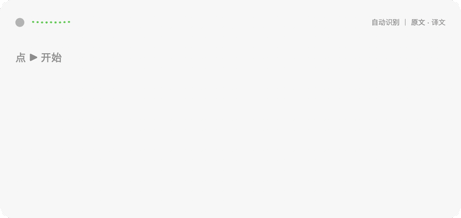
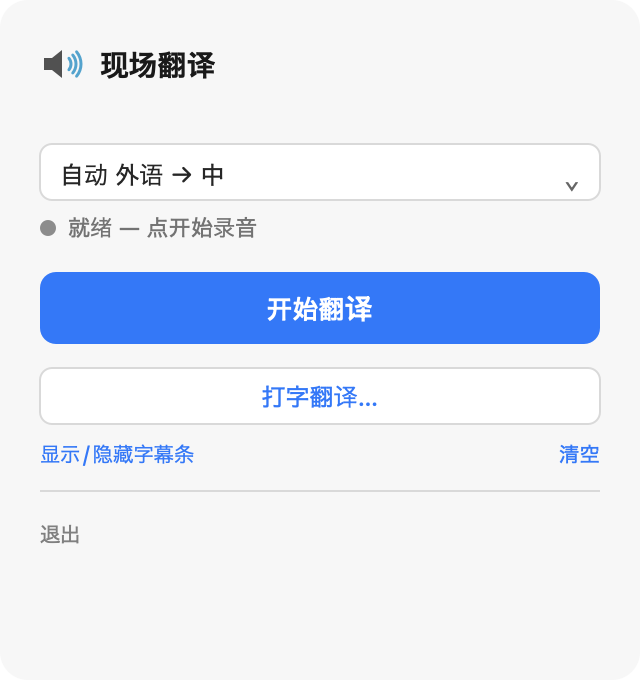
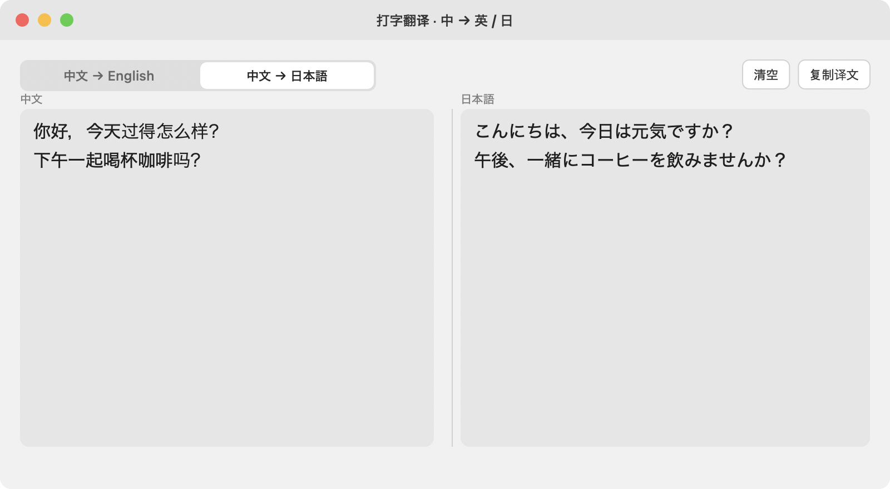

<p align="center">
  
</p>

<h1 align="center">LiveTranslate · Live Speech Translation</h1>

<p align="center"><b>English</b> · <a href="./README.zh.md">中文</a></p>

A macOS menu-bar tool that live-translates speech between **Chinese ⇄ English / Japanese**. Source + translation appear as paired bilingual subtitles in an always-on-top floating bar. Also supports **type-to-translate** — type Chinese in a window, get English or Japanese in real time. **Runs entirely on-device — no audio or text ever leaves your machine.**

For in-person conversations, meetings, lectures, unsubtitled livestreams — both *"hear a foreign language, see Chinese"* and *"speak Chinese, see a foreign language"*. Type-to-translate also covers writing emails / messages to non-Chinese contacts.



> Sample dialogue: source + translation appear as paired blocks, like bilingual subtitles. In actual use the source line follows your speech in real time, with the translation arriving one beat behind.

## Features

- 🎙 **Real-time streaming** — words appear as you speak (streaming ASR)
- 🌏 **5 translation directions** — auto (EN/JA→ZH), JA→ZH, EN→ZH, ZH→EN, ZH→JA; auto mode detects EN vs JA per utterance
- ⌨️ **Type-to-translate** — separate window for typing Chinese → English / Japanese (350 ms debounce, one-click copy)
- 🪟 **Floating caption bar** — always-on-top, cross-Space, draggable; source + translation appear together as paired blocks
- 🔒 **Fully on-device** — speech recognition (WhisperKit / Apple Neural Engine) + translation (Apple Translation framework) all run locally, offline-capable
- 📊 Recording-state indicator + live audio waveform meter

## Screenshots

### Menu bar control panel


Click the speaker icon in your menu bar to open the control panel. Pick a direction (5 options), start / stop translation, show / hide the floating caption bar, open the type-to-translate window.

### Type-to-translate window


For writing emails / messages to non-Chinese contacts. Type Chinese on the left; the translation in English or Japanese appears on the right in real time (350 ms debounce). Switch direction any time; copy the translation with one click.

## Install

```bash
bash scripts/install.sh
```

This will: release-compile → package → install to `/Applications` → set up launch-at-login + auto-restart-on-crash.

After install, a speaker icon appears in the menu bar. Click it → pick a language → "开始翻译" (Start) → the floating caption bar appears.

**First-time setup**:
- macOS will ask for **microphone permission** → allow
- The first translation for a new language pair triggers a system prompt to **download the translation language pack** (one-time, then offline)
- First launch also downloads a small Whisper speech model (~150 MB, one-time)

Uninstall: `bash scripts/uninstall.sh`

## About the latency

Live real-time translation **inherently has 2-4 seconds of lag** — this is the level of professional simultaneous interpreters (the literature calls it *ear-voice span*). Accurate translation requires a relatively complete sentence, and you can't see the speaker's "future" words. This is a physical law, not a bug. The caption bar's paired-block design tries to make this latency visually as natural as possible.

> YouTube-style video translation plugins feel fast and accurate because they work on **recorded content** — captions are pre-existing, the entire video is visible, translation can be done offline at leisure. That's a fundamentally different problem from live speech.

## Tech stack

| Layer | What |
|---|---|
| Speech recognition | [WhisperKit](https://github.com/argmaxinc/WhisperKit) (local Whisper, runs on the Apple Neural Engine) |
| Translation | Apple `Translation` framework (macOS 15+ system-level on-device translation) |
| Audio | `AVAudioEngine` / WhisperKit `AudioStreamTranscriber` (built-in VAD) |
| UI | SwiftUI `MenuBarExtra` + floating `NSPanel` |
| Persistence | launchd KeepAlive (launch-at-login + auto-restart-on-crash) |

Requires **macOS 15 (Sequoia) or newer** (Apple Translation framework requirement), Apple Silicon.

## Local development

```bash
swift build                 # compile
bash scripts/make-app.sh    # package into build/LiveTranslate.app
open build/LiveTranslate.app
```

Debug logging: flip `enableDebugLog` to `true` in `Sources/live-translate/Debug.swift`; logs are written to `/tmp/lt-debug.log`.
